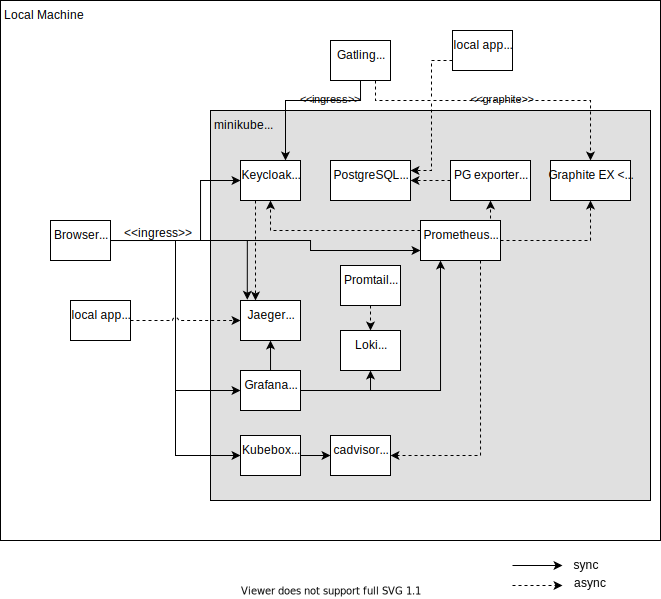

= Provision Keycloak for a benchmark test with minikube
:experimental:
:icons: font

== About

This describes on how to install Keycloak and a Grafana/Prometheus monitoring stack.

This uses minikube to run the containers, and Helm to provision the containers.
Kubectl is used to interact with minikube on the command line.
https://github.com/astefanutti/kubebox[Kubebox] is installed for a minimal UI to inspect containers within minikube.

The helm charts for Keycloak can be configured to just deploy Kubernetes without the dependency on the PodMonitor and ServiceMonitor dependencies.

This setup has an optional OpenTelemetry setup that will gather additional metrics and will publish traces from within Keycloak to Jaeger service.
This allows to measure the latency per endpoint, and tracing of the database statements executed by a given REST endpoint.
It also collects the logs of all containers inside Loki that can be queried from Grafana.

It also contains Tempo as an alternative tracing option.
While traces are submited via otel successfully and the search by trace ID works as expected, the search for traces (currently beta) doesn't doesn't return some traces (for example deletion of users).

== Alternatives considered

This paragraph describes some of the possible alternatives and how they differ from the current approach:

Docker Compose::
+
--
* This setup would have been more minimal, as it wouldn't require a virtual machine for its setup.

* Docker Compose would support CPU limits when running real Docker, but not Podman.

* Docker Compose doesn't support templating so customizing different setups with different CPU limits is difficult while such templating is available with Helm for Minikube.
For the Grafana stack there is a good customizable Helm template with no such way for Docker Compose.
--
+
*Decision:* Go with Minikube, while still keeping Docker Compose as a minimal setup for ad-hoc testing and to allow for a small effort solution for the community.
(Proposed by Alexander Schwartz in May 2022)
+
*Scope:* Docker Compose will contain only Keycloak and a database, and will not contain a monitoring stack, and will not impose any CPU limits.

OpenShift Local (formerly known as CodeReady Containers)::
+
--
* It would have the same capabilities as Minishift, with operator support already installed.
It could be setup automatically (if the developer registers for a Red Hat account and would get a pull secret).

* OpenShift style Monitoring could be installed either via the standard monitoring functionality/operators, and possibly with additional extensions.
On the other hand, the helm charts seem to be more configurable than the OpenShift operator.

* The team of the Keycloak Java operator is working with Minikube to test it, and the operator hub functionality can be installed within minutes with a shell script.
This would allow for running the Keycloak operator on Minishift for this setup as well.

* OpenShift Local will always use a VM, and will be more heavyweight in terms of CPU and RAM usage.
Installing OpenShift is a bigger step for a community contributor.
In the long term, maintaining the setup for both OpenShift and Minikube might be a higher maintenance cost.
Installing OpenShift Local from scratch takes a lot longer than installing Minishift, as OpenShift comes with a lot more Operators that need to download and start their containers and will wait for dependencies.

* Minikube has a mechanism to build containers in a lightweight way locally and provide them to the running Minikube instance.
The alternative for OpenShift would be https://docs.openshift.com/container-platform/4.10/cicd/builds/creating-build-inputs.html#builds-binary-source_creating-build-inputs[binary builds].
--
+
*Decision:* Go with Minikube for now.
Add additional parameterization to the Helm scripts later where needed to deploy on OpenShift (either Local or regular).
Revisit the decision later once the first OpenShift deployments have been made.
(Proposed by Alexander Schwartz in May 2022)

== Present and future

This has been set up for a local developer setup.
Kubebox, Prometheus and Grafana don't require authentication, therefore it shouldn't be installed in an environment that is accessible from remote.

This project should eventually evolve to a setup with multiple namespaces to represent different datacenters.

== Limitations

For Linux, the kvm2 driver is needed for a scalable solution (tested 15 Keycloak replicas).
More instances are possible when adding more than 8 GB of RAM.

The podman driver on Linux currently supports at the moment only up to 5 instances of Keycloak due to the number of open files limit that is actually a limit of the number of threads.
After that, the containers will complain that they're unable to start more processes.

== Architecture

This describes the runtime view of the setup:

.Minikube runtime view

The setup is as follows:

* Minikube runs a virtual machine
* Via a configured an ingress, a local browser can access different services running in Minikube like Keycloak and Grafana
* Keycloak connects to a PostgreSQL DB running inside Minikube
* Prometheus collects metrics, and Jaeger collects traces
* Promtail collects logs and sends it to Loki which stores them

== Prerequisites

The following needs to be installed on the local machine:

* https://minikube.sigs.k8s.io/docs/start/[Minikube]
* https://helm.sh/docs/intro/install/[Helm]
* https://kubernetes.io/docs/tasks/tools/[kubectl]

The installation can be performed on Linux as follows:

. Download each executable and place it in ~/bin
. Add the following snippet to ~/.bashrc to allow auto-completion of commands
+
----
source <(minikube completion bash)
source <(helm completion bash)
source <(kubectl completion bash)
----

////
Not needed for kvm2 driver

Increase the number of files by adding the following to `/etc/systemd/system.conf` and `/etc/systemd/user.conf`:

----
DefaultLimitNOFILE=102400:524288
----

Test the settings afterwards using `ulimit -n`, it should match the first value.

WARNING: There still seems to eb a limit of around ~2k container threads in total that prevents more than 5 running instances of Keycloak.
////

== Installation

=== For the impatient

The installation has been scripted in `allinone.sh`.
Run this script, and see the URLs printed in the console to access the different services.

Wait a bit for all containers to be pulled from the internet, then get started.

The following commands helps to watch the pods being started, use kbd:[Ctrl+C] to end watching.

[source,shell]
----
kubectl get pods -A -w
----

The following script will check if all services are running and will output a list of available URLs.

[source,shell]
----
./isup.sh
----

=== For more insights and backgrounds

This section will show the different steps with variants, explain them a bit more.
It also shows the `helm upgrade` commands that can update parts of the stack incrementally which helps development and upgrades.

Startup Minikube in default mode with a VM.
Per default, it will use 2 CPUs, and this can be adjusted

[source,shell]
----
minikube start
----

Start with customized settings.

[source,shell]
----
minikube stop
minikube delete
minikube start --memory 8192 --cpus 4
----

Depending on the driver, adjusting the settings might work for an already created minikube instance.

[source,shell]
----
minikube stop
minikube config set memory 8192
minikube config set cpus 4
minikube start
----

Startup Minikube on Linux w/ podman driver.
This allows faster startup times, less overhead, and no limitation (?) on CPU usage.

////
Installation of cri-o not needed, cri-o will run inside the minikube podman?
dnf module enable cri-o:1.19
dnf install cri-o
////

[source,shell]
----
minikube start --driver=kvm2 --docker-opt="default-ulimit=nofile=102400:102400"
----

For a lightweight installation that today doesn't scale beyond 3-5 Keycloak instances:

[source,shell]
----
minikube start --driver=podman --container-runtime=cri-o
----

On Linux, allow to use podman and crio via sudo:

. run `sudo visudo`
. add the following to the sudoer's file
+
----
username ALL=(ALL) NOPASSWD: /usr/bin/podman
username ALL=(ALL) NOPASSWD: /usr/bin/crictl
----

Adding ingress

[source,shell]
----
minikube addons enable ingress
----

Install Prometheus and Grafana (with commands for update and uninstall for completeness).

[source,shell]
----
helm repo add prometheus-community https://prometheus-community.github.io/helm-charts
helm repo update
kubectl create namespace monitoring
helm install prometheus prometheus-community/kube-prometheus-stack -f monitoring.yaml
helm upgrade prometheus prometheus-community/kube-prometheus-stack -f monitoring.yaml
helm uninstall prometheus
----

Install Customizations for Grafana, including an ingress for minikube.
(with commands for update and uninstall for completeness).
Login to Grafana with admin / keycloak unless anonymous login is enabled.

Custom dashboards are included in folder `monitoring/dashbaords`.
Add more dashboards there as new files, and a `helm update` will install the latest versions in the minikube cluster.

[source,shell]
----
helm install monitoring --set hostname=$(minikube ip).nip.io monitoring
helm upgrade monitoring --set hostname=$(minikube ip).nip.io monitoring
helm uninstall monitoring
----

Install Keycloak including monitoring (with commands for update and uninstall for completeness).

Set `monitoring` to `false` to install Keycloak without monitoring options.

[source,shell]
----
helm install keycloak --set hostname=$(minikube ip).nip.io keycloak
helm upgrade keycloak --set hostname=$(minikube ip).nip.io keycloak
helm uninstall keycloak
----

Add Tempo for tracing

[source,shell]
----
helm repo add grafana https://grafana.github.io/helm-charts
helm search repo grafana
helm install tempo grafana/tempo -n monitoring -f tempo.yaml
helm upgrade tempo grafana/tempo -n monitoring -f tempo.yaml
----

Add Loki to store information about logs, and promtail to collect the logs from all containers.

[source,shell]
----
helm install loki grafana/loki -n monitoring -f loki.yaml
helm install promtail grafana/promtail -n monitoring -f promtail.yaml

helm upgrade loki grafana/loki -n monitoring -f loki.yaml
helm upgrade promtail grafana/promtail -n monitoring -f promtail.yaml
----

Installing Jaeger as a tracing solution

[source,shell]
----
helm repo add jaegertracing https://jaegertracing.github.io/helm-charts
helm install jaeger jaegertracing/jaeger -n monitoring -f jaeger.yaml
helm upgrade jaeger jaegertracing/jaeger -n monitoring -f jaeger.yaml
----

== Pause/Resume setup

The setup can be paused and resumed without restarting/reinstalling all pods.

To stop, run the following command:

[source,bash]
----
minikube stop
----

To resume, run the following command and specify the driver you used when running minikube originally.

[source,bash]
----
minikube start --driver=...
----

After minikube has been re-started, it might have a different IP address for the ingress.
Due to that, all ingresses need to be updated.
Do this by running helm:

[source,bash]
----
helm upgrade monitoring --set hostname=$(minikube ip).nip.io monitoring
helm upgrade keycloak --set hostname=$(minikube ip).nip.io keycloak
----

